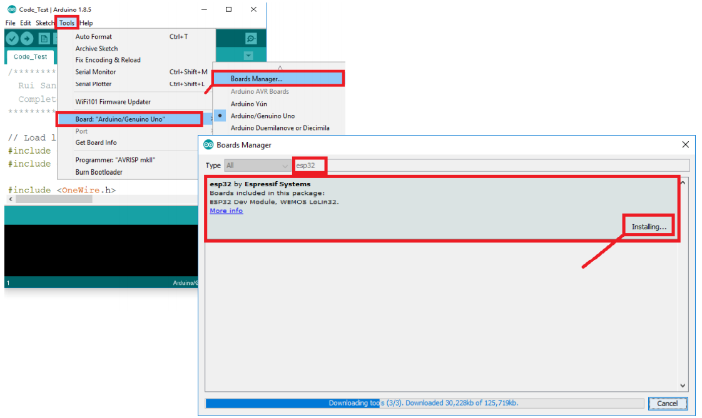
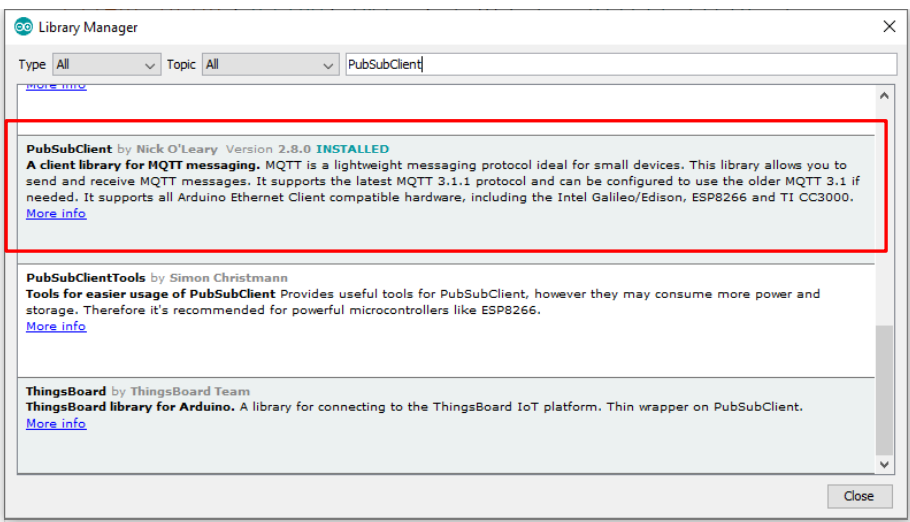
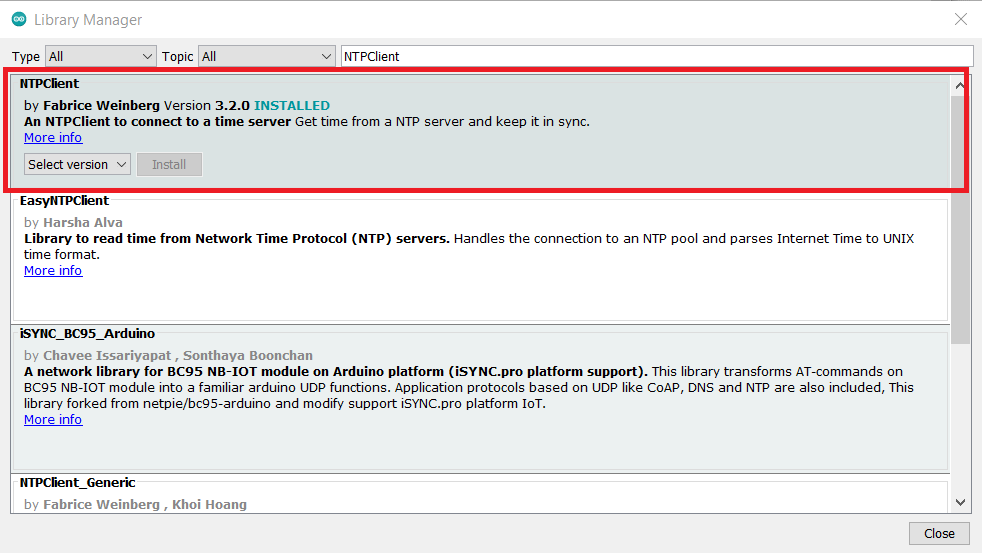
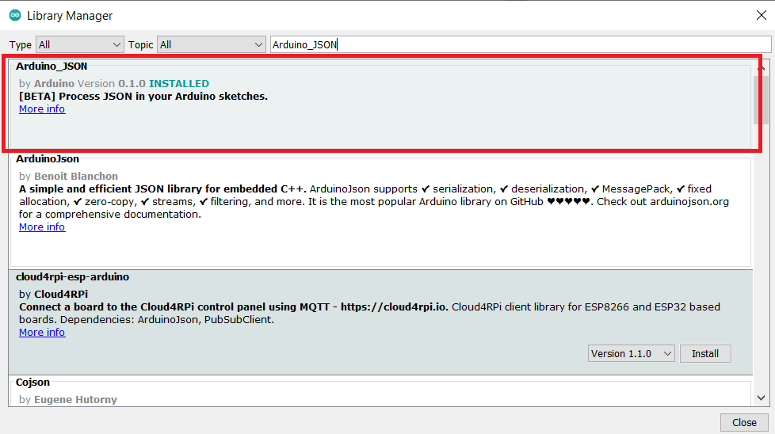
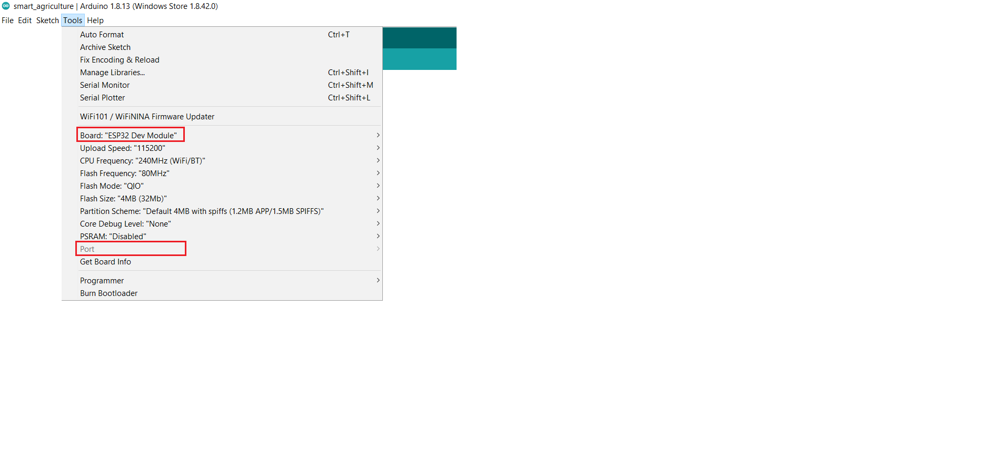

# IoT_SmartAgriculture
Thiết bị Device ESP32 đọc và gửi dữ liệu thông số môi trường cho server IBM Watson IoT Platform

## Install

### 1. Khởi tạo project
- clone code từ github và mở bằng Arduino IDE

### 2. Cài đặt Add-on ESP32 Board trên Arduino IDE
- Thêm https://dl.espressif.com/dl/package_esp32_index.json
vào trong File -> Preferences -> Additional Boards Manager URLs
- Chọn Tools -> Board -> Boards Manager...

### 3. Thêm các thư viện cần thiết
- Chọn Sketch -> Include Library -> Manager Libraries...
- các thư viện: PubSubClient, NTPClient, Arduino_JSON

## Run
- Cắm thiết bị ESP vào cổng USB và xem Port trong Device Manager
- Chỉnh các thông số trong Tools

-> Chọn Upload
